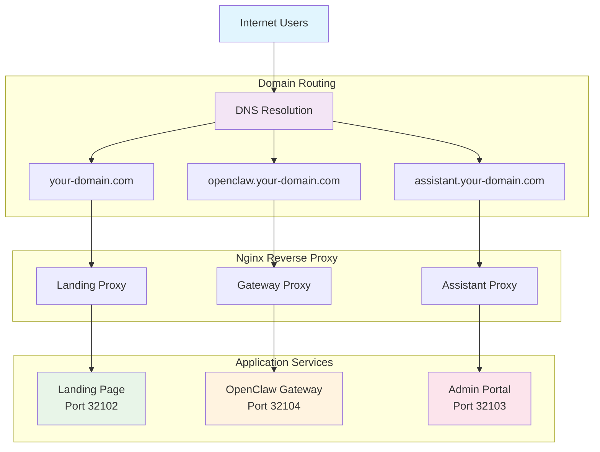

# CLAUDE.md

This file provides guidance to Claude Code (claude.ai/code) when working with code in this repository.

## Project Overview

**OpenClaw DevOps** is a full-stack DevOps platform with Next.js landing page, Nginx reverse proxy, AI gateway, databases, messaging, and monitoring infrastructure.

### Architecture



### Monorepo Structure

This project uses **pnpm workspaces** for monorepo management.

**Package Manager:** pnpm v9+

**Workspace Apps:**

- `@openclaw/landing` - Landing page (Next.js)
- `@openclaw/assistant` - Admin portal (Next.js)
- `@openclaw/gateway` - API gateway (Express.js)

### Core Services

**Basic Stack:**

- **Nginx** (port 32100/32101): Reverse proxy with rate limiting and WebSocket support
- **Landing Page** (port 32102): Next.js 16 standalone application
- **Gateway** (port 32104): OpenClaw AI gateway service

**Full Stack (docker-compose.full.yml):**

_Databases:_

- **MongoDB** (port 27017): Document database for application data
- **PostgreSQL** (port 5432): Relational database for structured data and n8n
- **Redis** (port 6379): Cache, session store, and message broker

_Messaging & Workflows:_

- **Kafka** (port 9092): Event streaming platform
- **Zookeeper** (port 2181): Kafka coordination service
- **n8n** (port 5678): Workflow automation platform

_Monitoring:_

- **Prometheus** (port 9090): Metrics collection and alerting
- **Grafana** (port 3001): Metrics visualization and dashboards
- **Exporters**: Node, cAdvisor, Redis, PostgreSQL, MongoDB metrics

### Domain Routing

- `your-domain.com` → Landing Page (Next.js on port 32102)
- `openclaw.your-domain.com` → Gateway service (port 32104)
- `assistant.your-domain.com` → Admin Assistant Portal (port 32103)

## Project Structure

```
$(pwd)/
├── apps/
│   ├── landing/              # Next.js landing page
│   ├── assistant/            # Admin portal (Next.js)
│   └── openclaw-gateway/     # Express.js API gateway
├── nginx/
│   ├── nginx.conf            # Main nginx config
│   ├── conf.d/               # Site-specific configs
│   │   ├── landing.conf      # Landing proxy
│   │   ├── openclaw.conf     # Gateway proxy
│   │   └── assistant.conf    # Assistant proxy
│   └── ssl/                  # SSL certificates
├── monitoring/
│   ├── prometheus/           # Prometheus configs
│   └── grafana/              # Grafana dashboards
├── deployments/
│   ├── gce/                  # GCE deployment scripts
│   └── local/                # Local dev configs
├── docker-compose.yml        # Basic stack
├── docker-compose.full.yml   # Full stack with all services
└── start-all.sh              # Quick start script
```

## Development Commands

### Quick Start

**For First-Time Setup (Recommended):**

```bash
# Interactive onboarding with configuration help
make onboarding

# This will guide you through:
#   1. Prerequisites check (Node.js, Docker, pnpm)
#   2. Environment file setup (.env)
#   3. Domain configuration
#   4. Security & password generation
#   5. OAuth setup (Google)
#   6. Optional services (Telegram, monitoring)
#   7. Installation & startup
```

**Manual Setup:**

```bash
# Install dependencies (first time)
cd $(pwd)
pnpm install

# Start basic stack (nginx + landing + gateway)
./start-all.sh

# Or manually
docker-compose up -d
```

### Interactive Onboarding

The `make onboarding` command provides an interactive setup wizard that configures all aspects of the platform:

**What It Configures:**

1. **Prerequisites Validation**
   - Node.js 20+ version check
   - Docker installation and daemon status
   - pnpm installation (auto-installs if missing)
   - Disk space availability

2. **Environment Setup**
   - Creates/backs up .env file
   - Option to reconfigure existing setup

3. **Domain Configuration**
   - Production domains (e.g., mycompany.com)
   - Development with localhost
   - Local domain testing (e.g., example.local)
   - Automatic CORS and NextAuth URL configuration

4. **Security Configuration**
   - Auto-generates 32+ character passwords for:
     - MongoDB (root and user)
     - PostgreSQL
     - Redis
     - n8n (password and encryption key)
     - Grafana
     - NextAuth secret
     - Gateway authentication token
   - Environment mode (development/production)

5. **OAuth & Authentication**
   - Google OAuth Client ID configuration
   - Allowed email domain whitelist
   - Guided credential creation

6. **Optional Services**
   - Telegram bot integration
   - Full monitoring stack (Prometheus, Grafana, n8n)
   - Database services (MongoDB, PostgreSQL, Redis)

7. **Installation & Startup**
   - Dependency installation
   - Docker image building
   - Service startup (basic or full stack)
   - Health check validation

**Usage:**

```bash
# Run interactive onboarding
make onboarding

# Or use the alias
make onboard
```

**Features:**

- ✅ Input validation (domains, emails)
- ✅ Smart defaults based on deployment type
- ✅ Automatic .env backup before changes
- ✅ Configuration summary at completion
- ✅ Skip options for each step
- ✅ Colored, user-friendly terminal UI

**When to Use:**

- First-time project setup
- Reconfiguring for new environment
- Setting up additional developer machines
- Migrating between environments (dev → staging → prod)

### pnpm Workspace Commands

```bash
# Install all dependencies
pnpm install

# Development servers
pnpm dev:landing      # Start landing dev server (port 32102)
pnpm dev:assistant    # Start assistant dev server (port 32103)
pnpm dev:gateway      # Start gateway dev server (port 32104)

# Build apps
pnpm build:landing    # Build landing for production
pnpm build:assistant  # Build assistant for production
pnpm build:all        # Build all apps

# Linting
pnpm lint:landing     # Lint landing app
pnpm lint:assistant   # Lint assistant app
pnpm lint:all         # Lint all apps

# Clean
pnpm clean            # Remove all node_modules and build artifacts
```

### Full Stack

```bash
# Setup environment
cp .env.example .env
./scripts/generate-passwords.sh

# Start all services
docker-compose -f docker-compose.full.yml up -d

# Start specific services
docker-compose -f docker-compose.full.yml up -d mongodb postgres redis
```

### Building Services

```bash
# Build landing page
cd apps/landing
docker build -t openclaw-landing:latest .

# Build gateway
cd apps/gateway
docker build -t openclaw-gateway:latest .

# Build assistant
cd apps/assistant
docker build -t openclaw-assistant:latest .
```

### Development Mode

```bash
# Landing page (with hot reload)
cd apps/landing
npm run dev
# Visit http://localhost:32102

# Gateway
cd apps/gateway
npm run dev
# API available at http://localhost:32104

# Assistant portal
cd apps/assistant
npm run dev
# Portal at http://localhost:32103
```

## Docker Operations

### Container Management

```bash
# View running containers
docker-compose ps

# View logs
docker-compose logs -f
docker-compose logs -f landing
docker-compose logs -f nginx

# Restart services
docker-compose restart
docker-compose restart landing

# Stop all
docker-compose down

# Clean up
docker-compose down -v
docker image prune -a
```

### Health Checks

```bash
# Check service health
curl http://localhost/health        # Nginx
curl http://localhost:32102          # Landing
curl http://localhost:32104         # Gateway

# Full stack health checks
curl http://localhost:9090/-/healthy # Prometheus
curl http://localhost:3001/api/health # Grafana
```

## Architecture Notes

### Docker Networking

**macOS/Windows (Development):**

- Uses **bridge networking** with port mappings
- Services communicate via Docker service names (e.g., `landing:3000`, `gateway:18789`)
- Ports exposed: `80:80`, `3000:3000`, `18789:18789`

**Linux (Production):**

- Can use **host networking** for better performance
- Services communicate via `localhost` or `127.0.0.1`
- No port mapping needed (direct host network access)

**Current Configuration:**
The project is configured for bridge networking (macOS compatible). To switch to host mode for Linux deployments:

1. Remove `ports:` sections from docker-compose.yml
2. Add `network_mode: "host"` to each service
3. Update nginx upstream servers to use `127.0.0.1` instead of service names

### Next.js Standalone Build

Landing page uses `output: "standalone"` in `next.config.ts`:

- Optimized production build in `.next/standalone/`
- Multi-stage Dockerfile for minimal image size
- Faster cold starts
- Self-contained: runs with `node server.js`

### Nginx Configuration

```
nginx/conf.d/
├── landing.conf      # your-domain.com → landing:32102
├── openclaw.conf     # openclaw.your-domain.com → gateway:32104
└── assistant.conf    # assistant.your-domain.com → assistant:32103
```

Each config includes:

- Rate limiting (100 req/min for landing, 60 req/min for gateway)
- WebSocket support (Upgrade headers)
- Health check endpoint at `/health`
- Proper proxy headers and timeouts

## Common Workflows

### Updating a Service

1. Make code changes in `apps/<service>/`
2. Rebuild Docker image:
   ```bash
   cd apps/<service>
   docker build -t openclaw-<service>:latest .
   ```
3. Restart container:
   ```bash
   docker-compose restart <service>
   ```

### Modifying Nginx Configuration

1. Edit `nginx/nginx.conf` or `nginx/conf.d/*.conf`
2. Test configuration:
   ```bash
   docker-compose exec nginx nginx -t
   ```
3. Reload nginx:
   ```bash
   docker-compose exec nginx nginx -s reload
   ```

### Database Operations

```bash
# MongoDB
docker-compose -f docker-compose.full.yml exec mongodb \
  mongosh -u admin -p <password>

# PostgreSQL
docker-compose -f docker-compose.full.yml exec postgres \
  psql -U postgres_admin -d openclaw

# Redis
docker-compose -f docker-compose.full.yml exec redis \
  redis-cli -a <password>

# Kafka topics
docker-compose -f docker-compose.full.yml exec kafka \
  kafka-topics --list --bootstrap-server localhost:9092
```

### Security Scanning

The project includes comprehensive security scanning with Trivy and Semgrep.

**Installation:**

```bash
# Install security tools
make security-install
# or
./scripts/install-security-tools.sh
```

**Running Scans:**

```bash
# Run all security scans
make security-scan

# Run specific scans
make security-trivy      # Vulnerability scanning
make security-semgrep    # Code analysis
make security-docker     # Docker image scanning
make security-fix        # Auto-fix issues (Semgrep)

# Or use npm scripts
pnpm security:scan
pnpm security:trivy
pnpm security:semgrep
pnpm security:docker
pnpm security:fix
```

**Scan Options:**

```bash
# Custom severity level
./scripts/security-scan.sh --all --severity CRITICAL,HIGH

# Save reports to custom directory
./scripts/security-scan.sh --all --report ./my-reports

# Scan Docker images
./scripts/security-scan.sh --docker

# Apply automatic fixes
./scripts/security-scan.sh --semgrep --fix
```

**Security Scanning Workflow:**

1. **Before Committing:**

   ```bash
   # Scan for secrets and critical issues
   make security-trivy
   ```

2. **Before Pushing:**

   ```bash
   # Full security scan
   make security-scan
   ```

3. **Before Releasing:**

   ```bash
   # Comprehensive scan including Docker images
   make security-scan
   make security-docker

   # Review reports
   ls -lh ./security-reports/
   ```

4. **CI/CD Integration:**
   - Scans run automatically on every push/PR
   - Results uploaded to GitHub Security tab
   - Check: Security > Code scanning alerts

**Configuration Files:**

- `trivy.yaml` - Trivy configuration
- `.trivy-secret.yaml` - Secret detection rules
- `.trivyignore` - Ignore specific vulnerabilities
- `.semgrep.yml` - Semgrep configuration
- `.semgrepignore` - Exclude files from scanning

**Pre-commit Hooks (Optional):**

Enable security scanning in git hooks by uncommenting the security sections in:

- `.husky/pre-commit` - Secret scanning before commits
- `.husky/pre-push` - Vulnerability scanning before pushes

**Documentation:**

- `SECURITY-SCANNING.md` - Complete security scanning guide
- `SECURITY-QUICKSTART.md` - Quick reference
- `SECURITY.md` - General security documentation

## Troubleshooting

### Service Not Accessible

```bash
# 1. Check if container is running
docker-compose ps

# 2. Check container logs
docker-compose logs <service>

# 3. Check port binding
docker ps --format "table {{.Names}}\t{{.Ports}}"

# 4. Test direct service access
curl http://localhost:<port>
```

### Nginx 502 Error

```bash
# 1. Verify upstream services are running
curl http://localhost:32102   # Landing
curl http://localhost:32104  # Gateway

# 2. Check nginx configuration
docker-compose exec nginx nginx -t

# 3. View nginx error logs
docker-compose logs nginx

# 4. Check nginx upstream configuration
docker-compose exec nginx cat /etc/nginx/conf.d/landing.conf
```

### Port Conflicts

```bash
# Check which process is using a port
lsof -i :80
lsof -i :3000
lsof -i :18789

# Kill process using port (if needed)
kill -9 <PID>
```

### Health Check Failures

Health checks have a 40-second start period. If showing "unhealthy":

1. Wait 40-60 seconds after container start
2. Check if wget is available in container: `docker exec <container> which wget`
3. Test health check manually: `docker exec <container> wget --quiet --tries=1 --spider http://localhost:<port>`

## Deployment

### Production (GCE)

```bash
# Deploy to Google Compute Engine
cd deployments/gce
./deploy.sh

# First time setup
./quick-setup.sh
./deploy.sh --setup --build
```

**Management Scripts:**

- `deployments/gce/scripts/start.sh [service]` - Start services
- `deployments/gce/scripts/stop.sh [service]` - Stop services
- `deployments/gce/scripts/restart.sh [service]` - Restart services
- `deployments/gce/scripts/logs.sh [service] [-f]` - View logs
- `deployments/gce/scripts/status.sh` - Check health

### Local Development

```bash
# Full stack
./start-all.sh

# Hybrid mode (Nginx + Next.js dev server)
cd deployments/local
./scripts/dev.sh
```

See `DEPLOYMENT.md` for comprehensive deployment documentation.

## Open Source Repository Rules

**⚠️ CRITICAL: This is an open-source repository. NO deployment-specific information should EVER be committed.**

### Prohibited Content

**NEVER commit:**

1. **Real IP Addresses**
   - ❌ Public IPs (e.g., `58.136.234.96`)
   - ❌ Private IPs (e.g., `192.168.1.152`)
   - ✅ Use: `YOUR_PUBLIC_IP`, `YOUR_PRIVATE_IP`, `0.0.0.0`, `127.0.0.1`, `localhost`

2. **Real Domain Names**
   - ❌ Actual domains (e.g., `agents.ddns.net`, `mycompany.com`)
   - ✅ Use: `your-domain.com`, `example.com`, `localhost`

3. **API Keys & Secrets**
   - ❌ Any real API keys, tokens, or secrets
   - ❌ OAuth client IDs/secrets
   - ❌ Database passwords
   - ✅ Use: Environment variables with examples in `.env.example`
   - ✅ Use: Placeholder values like `your_api_key_here`, `changeme`

4. **User-Specific Paths**
   - ❌ Absolute paths with usernames (e.g., `/Users/lps/server`)
   - ✅ Use: Relative paths (e.g., `./`, `$(pwd)`)
   - ✅ Use: Environment variables (e.g., `$HOME`, `${PROJECT_ROOT}`)

5. **Personal Information**
   - ❌ Real email addresses
   - ❌ Real names in configs
   - ❌ Organization-specific details
   - ✅ Use: `admin@example.com`, `your-email@example.com`

6. **Environment Files**
   - ❌ `.env` file (contains secrets)
   - ✅ `.env.example` (template with placeholders)
   - ✅ Ensure `.env` is in `.gitignore`

### Verification Checklist

Before committing, verify:

```bash
# Check for sensitive data
make check-sanitization

# Search for real IPs
grep -r "58\.136\.234\.96\|192\.168\.1\.152" . --exclude-dir={node_modules,.git}

# Search for real domains
grep -r "agents\.ddns\.net" . --exclude-dir={node_modules,.git}

# Ensure .env is not tracked
git status | grep -q "\.env$" && echo "❌ .env is tracked!" || echo "✅ .env not tracked"

# Verify .env is ignored
git check-ignore .env || echo "❌ .env is NOT in .gitignore!"
```

### Generic Placeholders to Use

**Domains:**
- `your-domain.com`
- `example.com`
- `localhost`
- `openclaw.your-domain.com`
- `assistant.your-domain.com`

**IPs:**
- `YOUR_PUBLIC_IP`
- `YOUR_PRIVATE_IP`
- `0.0.0.0`
- `127.0.0.1`
- `localhost`

**Credentials:**
- `your_password_here`
- `changeme`
- `your_api_key_here`
- `your_secret_here`
- `admin@example.com`

**Paths:**
- `$(pwd)` - Current directory
- `./` - Relative path
- `${PROJECT_ROOT}` - Project root variable
- `/path/to/project` - Generic path

### Auto-Sanitization

Use the sanitization script before making the repo public:

```bash
# Sanitize all deployment references
make sanitize

# Review changes
git diff

# Check if sanitized
make check-sanitization
```

### Code Review Requirements

All code changes MUST be reviewed for:

1. **No hardcoded values** - All configs use environment variables
2. **Generic examples** - Documentation uses placeholder values
3. **No real credentials** - Only examples in `.env.example`
4. **No absolute paths** - Use relative paths or variables
5. **Proper .gitignore** - Sensitive files are ignored

### Emergency Cleanup

If sensitive data was accidentally committed:

```bash
# 1. Remove from working directory
git rm --cached .env

# 2. Add to .gitignore if not already
echo ".env" >> .gitignore

# 3. Amend last commit (if just committed)
git commit --amend

# 4. For older commits, rewrite history
git filter-branch --force --index-filter \
  "git rm --cached --ignore-unmatch .env" \
  --prune-empty --tag-name-filter cat -- --all

# 5. Force push (WARNING: coordinate with team first)
git push --force --all
```

**⚠️ IMPORTANT:** If secrets were pushed to remote:
1. Rotate all exposed credentials immediately
2. Revoke all exposed API keys
3. Update all affected services
4. Document the incident

### CI/CD Integration

Automated checks run on every push:

- ✅ Sanitization verification
- ✅ Secret scanning (Trivy)
- ✅ No .env file in commits
- ✅ No hardcoded IPs or domains
- ✅ .gitignore compliance

Commits will be **rejected** if they contain:
- Real IP addresses
- Real domain names
- API keys or secrets
- .env files

## Important Notes

### Security

- Change all default passwords in `.env` before production
- Use SSL certificates in production (place in `nginx/ssl/`)
- Configure firewall rules for production servers
- Monitor access logs regularly

### Performance

- Containers have health checks with 40s start period
- Wait for services to become healthy before testing
- Use `docker-compose logs` to debug startup issues

### DNS Configuration

Domain names must point to server IP:

- `your-domain.com` → Server IP
- `openclaw.your-domain.com` → Server IP
- `assistant.your-domain.com` → Server IP

Replace `your-domain.com` with your actual domain in `.env` configuration.

### Environment Variables

Critical environment variables in `.env`:

- Database passwords (MongoDB, PostgreSQL, Redis)
- Google OAuth credentials (for assistant portal)
- NextAuth secret
- Service ports

## Git Operations - Strict Mode

**⚠️ STRICT MODE ENABLED**

Before committing or pushing ANY changes, you MUST:

### Pre-Commit Requirements

1. **Build Verification**

   ```bash
   # MUST pass before committing
   pnpm build:all
   ```

   - If build fails: Fix errors before committing
   - Do NOT use `--no-verify` unless explicitly authorized
   - Do NOT bypass build failures

2. **Type Checking**

   ```bash
   # MUST pass before committing
   pnpm typecheck
   ```

   - Fix all TypeScript errors
   - Do NOT commit with type errors
   - Do NOT use `any` to bypass types

3. **Linting**
   ```bash
   # MUST pass before committing
   pnpm lint:all
   ```

   - Fix all linting errors
   - Apply auto-fixes where possible: `pnpm lint:all --fix`
   - Do NOT ignore linting rules without justification

### Pre-Push Requirements

**CRITICAL: Do NOT push if ANY of these checks fail**

1. **Full Build Check**

   ```bash
   # All apps must build successfully
   pnpm build:all
   ```

2. **Test Suite** (if tests exist)

   ```bash
   pnpm test
   ```

3. **Security Scan** (for production branches)

   ```bash
   make security-scan
   ```

4. **Working Tree Check**
   ```bash
   # Ensure no uncommitted changes
   git status
   ```

### Strict Mode Rules

**DO:**

- ✅ Always run builds before committing
- ✅ Fix TypeScript errors immediately
- ✅ Test changes locally before pushing
- ✅ Review all changes with `git diff`
- ✅ Write descriptive commit messages
- ✅ Use conventional commit format (feat:, fix:, docs:, etc.)
- ✅ Include Co-Authored-By line in commits

**DO NOT:**

- ❌ Push with build failures
- ❌ Push with TypeScript errors
- ❌ Push with test failures
- ❌ Use `--no-verify` without explicit permission
- ❌ Force push to main/master branches
- ❌ Commit sensitive data (.env, secrets, API keys)
- ❌ Push directly to protected branches

### Bypass Authorization

Use `--no-verify` ONLY when:

1. Pre-commit hooks are blocking a legitimate commit
2. TypeScript errors are in external dependencies
3. User explicitly requests bypassing checks
4. Emergency hotfix is required

**Always document why you're bypassing checks in the commit message.**

### Error Handling Workflow

**If build fails:**

```bash
# 1. View the error
pnpm build:all

# 2. Fix the issue in the relevant app
cd apps/[app-name]
# Fix the error

# 3. Verify fix
pnpm build

# 4. Return to root and build all
cd ../..
pnpm build:all

# 5. Then commit
git add .
git commit -m "fix: resolve build error in [app-name]"
```

**If TypeScript fails:**

```bash
# 1. Run type check to see all errors
pnpm typecheck

# 2. Fix type errors
# Edit the files with errors

# 3. Verify fixes
pnpm typecheck

# 4. Then commit
git commit -m "fix: resolve TypeScript errors"
```

**If tests fail:**

```bash
# 1. Run tests to identify failures
pnpm test

# 2. Fix failing tests or code
# Edit test or source files

# 3. Verify fixes
pnpm test

# 4. Then commit
git commit -m "fix: resolve test failures"
```

### Push Verification Process

**Before EVERY push, verify:**

```bash
# 1. Check current branch
git branch --show-current

# 2. Check for uncommitted changes
git status

# 3. Run full build
pnpm build:all

# 4. Check for TypeScript errors
pnpm typecheck

# 5. Only if ALL pass, then push
git push
```

### Commit Message Format

**Required format:**

```
<type>: <description>

[optional body]

Co-Authored-By: Claude Sonnet 4.5 <noreply@anthropic.com>
```

**Types:**

- `feat:` - New feature
- `fix:` - Bug fix
- `docs:` - Documentation changes
- `chore:` - Maintenance tasks
- `refactor:` - Code refactoring
- `test:` - Test changes
- `ci:` - CI/CD changes
- `perf:` - Performance improvements

**Examples:**

```bash
git commit -m "feat: add user authentication to assistant portal

- Implement Google OAuth integration
- Add role-based access control
- Configure session management

Co-Authored-By: Claude Sonnet 4.5 <noreply@anthropic.com>"
```

### Protected Branches

**Never force push to:**

- `main`
- `master`
- `production`
- `develop`

**Ask user before:**

- Pushing to any branch for the first time
- Force pushing anywhere
- Deleting branches
- Merging into protected branches

### Issue Detection

**If you encounter ANY of these, STOP and report:**

- Build failures
- TypeScript errors (except in dependencies)
- Test failures
- Linting errors
- Security vulnerabilities
- Merge conflicts
- Missing dependencies

**Report format:**

```
⚠️ STRICT MODE: Cannot proceed with commit/push

Issue detected: [description]
Location: [file:line]
Error: [error message]

Required action: [what needs to be fixed]

Awaiting user guidance before proceeding.
```

## Documentation Standards

### ⚠️ CRITICAL RULE: Documentation Location

**ALL external/user-facing documentation MUST be in the `wiki/` directory.**
**Internal audit reports and final details go in `docs/` (gitignored).**

**What goes in `wiki/` (PUBLIC - for users):**
- ✅ User guides, tutorials, how-tos
- ✅ Setup and installation guides
- ✅ Architecture and system design
- ✅ API references
- ✅ Deployment guides
- ✅ Troubleshooting and FAQ
- ✅ Community guidelines
- ✅ All public-facing documentation

**What goes in `docs/` (INTERNAL - gitignored):**
- ✅ Internal audit reports
- ✅ Implementation summaries
- ✅ Sanitization reports
- ✅ Final verification documents
- ✅ Internal technical notes

**Exceptions (allowed in root):**
- ❌ ONLY these standard files can be in root:
  - `README.md` - Project overview (required for GitHub)
  - `CLAUDE.md` - This file (AI assistant guidance)
  - `CONTRIBUTING.md` - Contribution guidelines (GitHub standard)
  - `LICENSE` - License file (GitHub standard)
  - `SECURITY.md` - Security policy (GitHub Security standard)
  - `.env.example` - Environment template
  - `package.json`, `pnpm-workspace.yaml` - Package configs
  - `Makefile` - Build commands
  - `docker-compose*.yml` - Docker configurations

**Examples:**

```bash
# ✅ CORRECT - User-facing docs in wiki/
wiki/setup/Installation-Guide.md
wiki/guides/Quick-Start.md
wiki/deployment/GCE-Guide.md
wiki/Architecture-Overview.md

# ✅ CORRECT - Internal reports in docs/
docs/AUDIT-REPORT.md
docs/IMPLEMENTATION-SUMMARY.md
docs/VERIFICATION-REPORT.md

# ❌ WRONG - Do NOT generate in root
INSTALLATION-GUIDE.md         # Should be wiki/setup/
AUDIT-REPORT.md              # Should be docs/
```

**When creating new documentation:**
1. **For users:** Use `wiki/category/Document-Name.md`
2. **For internal:** Use `docs/DOCUMENT-NAME.md` (gitignored)
3. **Never use root:** Don't create `DOCUMENT-NAME.md` in project root
4. Update `wiki/Home.md` or `wiki/README.md` with links
5. Use wikilinks in wiki: `[[Document Name]]`
6. Use relative links elsewhere: `[Guide](./guide.md)`

### wiki/ Directory Structure

The `wiki/` directory contains ALL user-facing documentation in Obsidian-compatible markdown format:

**Directory Layout:**

```
wiki/
├── Home.md                       # Wiki home page
├── README.md                     # Wiki index
├── Architecture-Overview.md      # System architecture
├── ROADMAP.md                    # Project roadmap
├── CODE_OF_CONDUCT.md           # Community guidelines
├── COMMUNITY.md                 # Community information
├── SECURITY.md                  # Security policy
├── SUPPORT.md                   # Support information
├── setup/                       # Setup & installation guides
├── guides/                      # How-to guides
├── deployment/                  # Deployment documentation
├── services/                    # Service documentation
└── troubleshooting/            # Problem-solving guides
```

**Internal Documentation (gitignored):**

```
docs/
├── AUDIT-REPORT.md             # Internal audits
├── IMPLEMENTATION-SUMMARY.md   # Implementation notes
└── VERIFICATION-REPORT.md      # Verification reports
```

### Documentation Rules

#### File Organization

1. **Primary Documentation**: Keep in root `docs/` directory
   - `README.md` - Documentation index and navigation
   - `ARCHITECTURE.md` - System architecture, diagrams, design decisions
   - `API-REFERENCE.md` - Complete API documentation
   - Add new primary docs as needed

2. **Backup/Archive**: Use `docs/backup/` for:
   - Old versions of updated documents
   - Deprecated documentation
   - Historical reference material
   - Migration from root to organized structure

#### Documentation Standards

**Format Requirements:**

- All documentation MUST be in Markdown (.md)
- Use GitHub-flavored Markdown syntax
- Include table of contents for documents > 200 lines
- Use code blocks with language specification
- Include examples for all concepts

**Naming Conventions:**

- UPPERCASE for root-level docs (e.g., `ARCHITECTURE.md`, `API-REFERENCE.md`)
- Descriptive, hyphenated names (e.g., `deployment-guide.md`)
- Prefix with category for grouped docs (e.g., `api-gateway.md`, `api-services.md`)

**Content Standards:**

- **Headers**: Use ATX-style headers (`#`, `##`, `###`)
- **Code Examples**: Always include working examples with proper syntax highlighting
- **Links**: Use relative paths for internal documentation
- **Diagrams**: Use ASCII art, Mermaid, or linked images
- **Dates**: Include "Last Updated: YYYY-MM-DD" at bottom of each document
- **Version**: Include version number if applicable

**Required Sections:**

1. Title and brief description
2. Table of contents (if > 200 lines)
3. Quick start or overview
4. Detailed content
5. Examples (where applicable)
6. Related documentation links
7. Last updated date

#### API Documentation Standards

**API-REFERENCE.md Structure:**

```markdown
# API Reference

## Overview

Brief description of the API

## Base URL

Production and development URLs

## Authentication

How to authenticate

## Endpoints

### GET /endpoint

- Description
- Parameters
- Request example
- Response example
- Error codes

## Error Handling

Standard error format

## Rate Limiting

Rate limit policies
```

**API Examples:**

- Include curl examples
- Show request headers
- Show full response body
- Include error scenarios
- Document all query parameters

#### Architecture Documentation Standards

**ARCHITECTURE.md Structure:**

```markdown
# Architecture

## System Overview

High-level description

## Architecture Diagram

Visual representation

## Components

Detailed component descriptions

## Data Flow

How data flows through the system

## Technology Stack

Technologies used

## Design Decisions

Why certain choices were made

## Scalability

How system scales

## Security Considerations

Security architecture
```

**Diagrams:**

- Use ASCII art for simple diagrams
- Use Mermaid for complex diagrams
- Include both logical and physical architecture
- Show component interactions
- Document network topology

#### Writing Style

**Technical Writing:**

- Be concise and precise
- Use active voice
- Write in present tense
- Avoid jargon where possible
- Define technical terms on first use
- Use bullet points for lists
- Use numbered lists for sequences

**Code Examples:**

```bash
# Always include:
# 1. Comment explaining what the code does
# 2. Expected output
# 3. Error handling examples

# Good example
$ curl -H "Authorization: Bearer token" https://api.example.com/status
# Expected: {"status": "healthy"}

# Error case
$ curl https://api.example.com/status
# Error: {"error": "Authentication required"}
```

**Best Practices:**

- ✅ Include working examples
- ✅ Show both success and error cases
- ✅ Link to related documentation
- ✅ Keep examples up-to-date
- ✅ Test examples before committing
- ❌ Don't include outdated information
- ❌ Don't use broken links
- ❌ Don't duplicate content (use links instead)

#### Documentation Maintenance

**When to Update:**

- After adding new features
- When APIs change
- After architecture changes
- When fixing bugs that affect documented behavior
- During security updates

**Update Process:**

1. Update relevant documentation
2. Move old version to `docs/backup/` if major changes
3. Update "Last Updated" date
4. Update version number if applicable
5. Test all examples
6. Update links in other docs

**Review Checklist:**

- [ ] All code examples tested
- [ ] All links work
- [ ] Screenshots/diagrams current
- [ ] No placeholder content
- [ ] Grammar and spelling checked
- [ ] Table of contents updated (if applicable)
- [ ] Related docs linked
- [ ] Date updated

#### Special Documentation

**Security Documentation:**

- Store in root directory (e.g., `SECURITY.md`)
- Include vulnerability disclosure policy
- Document authentication/authorization
- Include security best practices
- List known limitations

**Migration Guides:**

- Store in root or `docs/` directory
- Include version information
- Provide step-by-step instructions
- Document breaking changes
- Include rollback procedures

**Deployment Documentation:**

- Store in root or `docs/` directory
- Environment-specific instructions
- Configuration examples
- Troubleshooting guides
- Health check procedures

#### Documentation Tools

**Markdown Linters:**

```bash
# Install markdownlint
npm install -g markdownlint-cli

# Lint documentation
markdownlint docs/**/*.md
```

**Link Checkers:**

```bash
# Check for broken links
npx markdown-link-check docs/**/*.md
```

**Table of Contents Generation:**

```bash
# Generate TOC
npx markdown-toc -i docs/ARCHITECTURE.md
```

### Documentation Index

The `docs/README.md` serves as the central index:

**Required Sections:**

1. **Overview** - What's documented
2. **Quick Links** - Most commonly used docs
3. **By Category** - Organized documentation list
4. **For Different Audiences** - Grouped by user type (developer, ops, manager)
5. **Contributing** - How to update documentation

**Example Structure:**

```markdown
# Documentation

## Quick Links

- [Architecture](ARCHITECTURE.md) - System design
- [API Reference](API-REFERENCE.md) - API documentation

## By Category

### Development

- Development workflow
- Testing guides
- Debugging

### Deployment

- Production deployment
- Environment configuration
- Monitoring

### Operations

- Troubleshooting
- Backup/restore
- Scaling
```

### Documentation Workflow

**Creating New Documentation:**

1. Determine if it's primary (root/docs) or reference (docs/backup)
2. Create file with proper naming convention
3. Follow template for document type
4. Include all required sections
5. Add to docs/README.md index
6. Test all examples
7. Submit for review

**Updating Existing Documentation:**

1. Read current version
2. Archive to docs/backup/ if major changes
3. Make updates
4. Test examples
5. Update date and version
6. Update related docs if needed

**Archiving Old Documentation:**

```bash
# Move to backup with timestamp
mv docs/OLD-GUIDE.md docs/backup/OLD-GUIDE-20260207.md

# Or keep generic name if it's the canonical old version
mv docs/OLD-GUIDE.md docs/backup/OLD-GUIDE.md
```

## Additional Resources

### Root-Level Documentation

- **README.md** - Project overview and quick start
- **SECURITY.md** - Security guide and vulnerability fixes
- **DEPLOYMENT-CONFIGURATION.md** - Deployment configuration guide
- **PRIVACY-AND-SANITIZATION.md** - Privacy and sanitization guide
- **FINAL-CONFIGURATION-SUMMARY.md** - Complete configuration summary

### Technical Documentation

- **docs/ARCHITECTURE.md** - System architecture and design
- **docs/API-REFERENCE.md** - Complete API documentation
- **docs/README.md** - Documentation index

### Deployment

- **DEPLOYMENT.md** - Deployment guide
- **deployments/gce/README.md** - GCE deployment
- **deployments/local/README.md** - Local development

### Other Resources

- **CLAUDE.md** - This file (developer guide)
- **CONTRIBUTING.md** - Contributing guidelines
- **SERVICES.md** - Services documentation
- **wiki/** - Additional wiki content

---

_Project: OpenClaw DevOps_
_Location: /Users/lps/server_
_Updated: 2026-02-08_
_**Strict Mode:** ENABLED - All commits/pushes require passing builds and tests_
