# OpenClaw DevOps

[](https://github.com/bemindlabs/OpenClaw-DevOps)
[](LICENSE)
[](https://nextjs.org)
[](https://react.dev)
[](https://www.typescriptlang.org)
[](https://nodejs.org)
[](https://expressjs.com)
[](https://www.docker.com)
[](https://pnpm.io)
[](https://www.mongodb.com)
[](https://www.postgresql.org)
[](https://redis.io)
[](https://nginx.org)
[](https://prometheus.io)
[](SECURITY-SCANNING.md)

> **⚠️ Project Status: Under Active Development**
>
> This project is currently under active development. Features may be incomplete, APIs may change, and documentation may be outdated. See [CHANGELOG.md](CHANGELOG.md) for recent changes.

Full-stack OpenClaw DevOps platform with Next.js landing page, AI-powered gateway, admin portal, databases, messaging, and monitoring infrastructure.

**✨ New Features:**

- 🤖 **Multi-Provider LLM Chat** - OpenAI, Anthropic, Google AI, Moonshot support
- 💬 **AI Assistant** - Built-in chat interface with command & assistant modes
- 🔄 **Automatic Fallback** - Seamless provider switching on failures
- 📊 **Real-time Monitoring** - Prometheus & Grafana dashboards
- 🔐 **Secure by Default** - OAuth authentication, rate limiting, health checks

## ✅ Current Status

**Working Services:**

- ✅ Landing Page (http://localhost:32102)
- ✅ Assistant Portal (http://localhost:32103) - **NEW!**
- ✅ Gateway API (http://localhost:32104)
- ✅ MongoDB Database
- ✅ PostgreSQL Database
- ✅ Redis Cache
- ✅ Prometheus Monitoring
- ✅ cAdvisor Metrics

**AI/LLM Features:**

- ✅ OpenAI Integration (GPT-4o)
- ⚠️ Anthropic (no credits)
- ⚠️ Google AI (configuration needed)
- ⚠️ Moonshot (authentication issue)

**Health Score: 67%** (8/12 services operational)

## 🏗️ Architecture

**🔒 Security-First Design:** Only Nginx is exposed externally. All other services are isolated on an internal Docker network.

```mermaid
graph TB
    Internet[🌐 Internet]

    subgraph External["🔓 External Access"]
        Nginx[Nginx Reverse Proxy<br/>Ports: 32100 HTTP / 32101 HTTPS<br/>⚠️ ONLY PUBLIC SERVICE]
    end

    Internet --> Nginx

    subgraph Internal["🔒 Internal Network<br/>openclaw-internal bridge"]
        subgraph Apps["Application Services<br/>Internal Only"]
            Landing[Landing Page<br/>Port: 32102<br/>Next.js 16]
            Gateway[OpenClaw Gateway<br/>Port: 32104<br/>Express.js]
            Assistant[Admin Portal<br/>Port: 32103<br/>Next.js 16 + OAuth]
        end

        subgraph Data["Data Services<br/>Internal Only"]
            MongoDB[MongoDB<br/>Port: 32120]
            PostgreSQL[PostgreSQL<br/>Port: 32121]
            Redis[Redis<br/>Port: 32122]
        end

        subgraph Monitor["Monitoring Stack<br/>Internal Only"]
            Prometheus[Prometheus<br/>Port: 32160]
            Grafana[Grafana<br/>Port: 32161]
            cAdvisor[cAdvisor<br/>Port: 32163]
        end

        subgraph LLM["LLM Providers<br/>Multi-Provider Fallback"]
            OpenAI[OpenAI<br/>Primary]
            Anthropic[Anthropic<br/>Fallback]
            GoogleAI[Google AI<br/>Fallback]
            Moonshot[Moonshot<br/>Fallback]
        end
    end

    Nginx -->|your-domain.com| Landing
    Nginx -->|openclaw.your-domain.com| Gateway
    Nginx -->|assistant.your-domain.com| Assistant

    Gateway --> MongoDB
    Gateway --> Redis
    Gateway --> OpenAI
    Gateway --> Anthropic
    Gateway --> GoogleAI
    Gateway --> Moonshot

    Assistant --> Gateway

    Landing --> Gateway

    Prometheus --> Gateway
    Prometheus --> Landing
    Prometheus --> Assistant
    Prometheus --> MongoDB
    Prometheus --> PostgreSQL
    Prometheus --> Redis
    Prometheus --> cAdvisor

    style Internet fill:#e1f5fe,stroke:#01579b,stroke-width:3px
    style Nginx fill:#ffccbc,stroke:#d84315,stroke-width:3px
    style Landing fill:#c8e6c9,stroke:#2e7d32
    style Gateway fill:#fff9c4,stroke:#f57f17
    style Assistant fill:#f8bbd0,stroke:#c2185b
    style MongoDB fill:#e1bee7,stroke:#6a1b9a
    style PostgreSQL fill:#bbdefb,stroke:#1565c0
    style Redis fill:#ffccbc,stroke:#e64a19
    style Prometheus fill:#ffe0b2,stroke:#ef6c00
    style Grafana fill:#b2dfdb,stroke:#00695c
    style cAdvisor fill:#d1c4e9,stroke:#4527a0
    style OpenAI fill:#c5e1a5,stroke:#558b2f
    style Anthropic fill:#f0f4c3,stroke:#9e9d24
    style GoogleAI fill:#ffecb3,stroke:#f57c00
    style Moonshot fill:#b3e5fc,stroke:#0277bd
```



**Port Range:** All services use centralized 32100-32199 range
**Network:** Docker bridge mode with `openclaw-internal` network
**Documentation:** See [PORT_MAP.md](PORT_MAP.md) for complete port reference

## 📁 Project Structure

```
./
├── apps/
│   ├── landing/              # Next.js landing page
│   ├── assistant/            # Admin portal (Next.js)
│   └── openclaw-gateway/     # Express.js API gateway
├── nginx/
│   ├── nginx.conf            # Main nginx config
│   ├── conf.d/
│   │   ├── landing.conf      # Landing proxy (your-domain.com)
│   │   ├── openclaw.conf     # Gateway proxy (openclaw.your-domain.com)
│   │   └── assistant.conf    # Assistant proxy (assistant.your-domain.com)
│   └── ssl/                  # SSL certificates
├── monitoring/
│   ├── prometheus/           # Metrics collection
│   └── grafana/              # Dashboards
├── deployments/
│   ├── gce/                  # GCE deployment scripts
│   └── local/                # Local dev configs
├── docker-compose.yml        # Basic stack (nginx + landing + gateway)
├── docker-compose.full.yml   # Full stack (all services)
└── start-all.sh              # Quick start script
```

## 🚀 Quick Start

### Prerequisites

- Docker & Docker Compose
- pnpm (for development mode)
- 8GB+ RAM recommended
- 10GB+ free disk space

### Option 1: Docker (Production Mode - Recommended)

```bash
# 1. Clone the repository
git clone https://github.com/bemindlabs/OpenClaw-DevOps.git
cd OpenClaw-DevOps

# 2. Setup environment (creates .env from example)
cp .env.example .env

# 3. Add your API keys to .env
nano .env  # Add OPENAI_API_KEY, etc.

# 4. Start all services with make
make

# This will:
# - Build all Docker images
# - Start containers (gateway, databases, monitoring)
# - Verify health checks
# - Show service URLs

# 5. Access services
# Landing: http://localhost:32102
# Assistant: http://localhost:32103
# Gateway: http://localhost:32104
```

### Option 2: Development Mode (Hot Reload)

```bash
# 1. Install dependencies
pnpm install

# 2. Start services
pnpm dev:landing      # http://localhost:32102
pnpm dev:assistant    # http://localhost:32103
pnpm dev:gateway      # http://localhost:32104

# Or start all in one command
make dev
```

### Option 3: Quick Start Script

```bash
# Automated setup with interactive prompts
make

# Or use the traditional script
./start-all.sh
```

### Development Mode

```bash
# Start all apps in development mode (hot reload)
make dev

# Or individually:
make dev-landing      # Landing page (port 32102)
make dev-assistant    # Assistant portal (port 32103)
make dev-gateway      # Gateway service (port 32104)
```

### Production Deployment

```bash
# Setup environment
make security-setup

# Verify security
make security-verify

# Deploy
make build
make start

# Check status
make status
```

## 🛠️ Development

### Build Services

```bash
# Build landing page
cd apps/landing
docker build -t openclaw-landing:latest .

# Build gateway
cd apps/gateway
docker build -t openclaw-gateway:latest .

# Build assistant portal
cd apps/assistant
docker build -t openclaw-assistant:latest .
```

### Development Mode (Hot Reload)

```bash
# Landing page
cd apps/landing
npm run dev
# Visit http://localhost:32102

# Gateway
cd apps/gateway
npm run dev
# API: http://localhost:32104

# Assistant portal
cd apps/assistant
npm run dev
# Portal: http://localhost:32103
```

## 🌐 Services

### Basic Stack

| Domain                    | Service   | Port  | Description          |
| ------------------------- | --------- | ----- | -------------------- |
| your-domain.com           | Landing   | 3000  | Next.js landing page |
| openclaw.your-domain.com  | Gateway   | 18789 | AI gateway service   |
| assistant.your-domain.com | Assistant | 5555  | Admin portal         |

### Full Stack (docker-compose.full.yml)

**Databases:**

- MongoDB (27017) - Document database
- PostgreSQL (5432) - Relational database
- Redis (6379) - Cache & session store

**Messaging:**

- Kafka (9092) - Event streaming
- Zookeeper (2181) - Kafka coordination
- n8n (5678) - Workflow automation

**Monitoring:**

- Prometheus (9090) - Metrics collection
- Grafana (3001) - Dashboards
- Exporters - Node, cAdvisor, Redis, PostgreSQL, MongoDB

## 🤖 AI/LLM Features

### Multi-Provider LLM Support

The gateway includes a sophisticated LLM service with automatic fallback support:

**Supported Providers:**

- ✅ **OpenAI** (GPT-4, GPT-4o, GPT-3.5) - Primary provider
- ✅ **Anthropic** (Claude 3.5 Sonnet, Claude 3 Opus)
- ✅ **Google AI** (Gemini Pro, Gemini Flash)
- ✅ **Moonshot/Kimi** (Chinese LLM with OpenAI-compatible API)

**Features:**

- **Automatic Fallback** - If primary provider fails, automatically tries alternative providers
- **Session Management** - Maintains conversation history per session (last 20 messages)
- **Provider Selection** - Configure primary and fallback providers via environment variables
- **Model Routing** - Route different tasks to different models (chat, completion, code, reasoning)

### Chat API

**Endpoint:** `POST http://localhost:32104/api/chat/message`

**Request:**

```json
{
  "message": "Your message here",
  "mode": "assistant",
  "sessionId": "optional-session-id"
}
```

**Response:**

```json
{
  "success": true,
  "response": "AI response here",
  "provider": "openai",
  "sessionId": "session-id",
  "id": "message-id",
  "timestamp": "2026-02-08T02:00:00.000Z"
}
```

**Example:**

```bash
curl -X POST http://localhost:32104/api/chat/message \
  -H "Content-Type: application/json" \
  -d '{"message":"Hello, how can you help?","mode":"assistant"}'
```

### Assistant Portal

Access the AI-powered admin portal at **http://localhost:32103**

**Features:**

- 💬 Dual-mode chat interface (Command mode & Assistant mode)
- 🔐 Google OAuth authentication
- 📊 Real-time service monitoring
- 🎨 Modern dark theme UI with shadcn/ui components
- 🔄 Proxy to gateway for secure API access

### Configuration

Add your API keys to `.env`:

```bash
# OpenAI (Primary)
OPENAI_API_KEY=sk-proj-your-key-here

# Anthropic (Fallback)
ANTHROPIC_API_KEY=sk-ant-your-key-here

# Google AI (Fallback)
GOOGLE_AI_API_KEY=AIza-your-key-here

# Moonshot/Kimi (Optional)
MOONSHOT_API_KEY=sk-kimi-your-key-here

# Provider Configuration
LLM_PROVIDER=openai
LLM_FALLBACK_PROVIDERS=anthropic,google,moonshot
```

### Model Configuration

Route different tasks to optimal models:

```bash
LLM_CHAT_MODEL=openai/gpt-4o
LLM_COMPLETION_MODEL=anthropic/claude-3-5-sonnet-20241022
LLM_EMBEDDING_MODEL=openai/text-embedding-3-small
LLM_CODE_MODEL=openai/gpt-4o
LLM_REASONING_MODEL=anthropic/claude-3-5-sonnet-20241022
```

## 🐋 Docker Commands

```bash
# View running containers
docker-compose ps
docker-compose -f docker-compose.full.yml ps

# View logs
docker-compose logs -f
docker-compose logs -f landing
docker-compose logs -f nginx

# Restart services
docker-compose restart
docker-compose restart landing

# Stop all
docker-compose down

# Rebuild and restart
cd apps/landing && docker build -t openclaw-landing:latest . && cd ../..
docker-compose up -d landing

# Clean up
docker-compose down -v
docker image prune -a
```

## 📊 Health Checks

### Quick Health Check

```bash
# Check all core services
make health
```

### Manual Service Checks

```bash
# Core Services
curl http://localhost:32102                    # Landing (Next.js)
curl http://localhost:32103                    # Assistant Portal
curl http://localhost:32104/health | jq .    # Gateway Health

# Databases
docker exec openclaw-mongodb mongosh --quiet --eval "db.adminCommand('ping')"
docker exec openclaw-postgres pg_isready -U postgres_admin
docker exec openclaw-redis redis-cli -a "${REDIS_PASSWORD}" ping

# Monitoring
curl http://localhost:9090/-/healthy         # Prometheus
docker exec openclaw-cadvisor wget -qO- http://localhost:8080/healthz

# AI/LLM Chat
curl -X POST http://localhost:32104/api/chat/message \
  -H "Content-Type: application/json" \
  -d '{"message":"Hello","mode":"assistant"}' | jq .
```

### Service Status Dashboard

```bash
# View all running containers
docker ps --format "table {{.Names}}\t{{.Status}}\t{{.Ports}}"

# Check container health
docker ps --filter "health=healthy"

# View resource usage
docker stats --no-stream
```

## 📝 Configuration

### Nginx

**Main Config:** `nginx/nginx.conf`
**Site Configs:** `nginx/conf.d/*.conf`

Each site config includes:

- Rate limiting
- WebSocket support
- Health check endpoint
- Proper proxy headers

### Environment Variables

Create `.env` from template:

```bash
cp .env.example .env
./scripts/generate-passwords.sh
```

Critical variables:

- Database passwords
- Google OAuth credentials
- NextAuth secret
- Service ports

### SSL Certificates

For production, place certificates in `nginx/ssl/`:

- `cert.pem` - Certificate
- `key.pem` - Private key

## 🔧 Common Operations

### Update a Service

1. Make changes in `apps/<service>/`
2. Rebuild:
   ```bash
   cd apps/<service>
   docker build -t openclaw-<service>:latest .
   ```
3. Restart:
   ```bash
   docker-compose restart <service>
   ```

### Update Nginx Configuration

1. Edit `nginx/nginx.conf` or `nginx/conf.d/*.conf`
2. Test config:
   ```bash
   docker-compose exec nginx nginx -t
   ```
3. Reload:
   ```bash
   docker-compose exec nginx nginx -s reload
   ```

### Database Access

```bash
# MongoDB
docker-compose -f docker-compose.full.yml exec mongodb \
  mongosh -u admin -p <password>

# PostgreSQL
docker-compose -f docker-compose.full.yml exec postgres \
  psql -U postgres_admin -d openclaw

# Redis
docker-compose -f docker-compose.full.yml exec redis \
  redis-cli -a <password>
```

## 🚨 Troubleshooting

### Service Not Accessible

```bash
# 1. Check container status
docker-compose ps

# 2. Check logs
docker-compose logs <service>

# 3. Check port binding
docker ps --format "table {{.Names}}\t{{.Ports}}"

# 4. Test direct access
curl http://localhost:<port>
```

### Nginx 502 Error

```bash
# Check upstream services
curl http://localhost:32102   # Landing
curl http://localhost:32104  # Gateway

# Verify nginx config
docker-compose exec nginx nginx -t

# Check nginx logs
docker-compose logs nginx
```

### Port Conflicts

```bash
# Check what's using a port
lsof -i :80
lsof -i :3000
lsof -i :18789

# Kill process if needed
kill -9 <PID>
```

### Health Check Failures

Health checks have a 40-second start period. If showing "unhealthy":

1. Wait 40-60 seconds after container start
2. Check logs: `docker-compose logs <service>`
3. Test health check manually:
   ```bash
   docker exec <container> wget --quiet --tries=1 --spider http://localhost:<port>
   ```

### AI/LLM Chat Issues

#### "All LLM providers failed"

```bash
# 1. Check API keys are set in .env
grep "API_KEY" .env | grep -v "CHANGE_ME"

# 2. Check gateway logs for specific provider errors
docker-compose logs gateway | grep "LLM\|Error with provider"

# 3. Test individual providers
curl -X POST http://localhost:32104/api/chat/message \
  -H "Content-Type: application/json" \
  -d '{"message":"test","mode":"assistant"}' | jq .

# Common fixes:
# - OpenAI: Remove or empty OPENAI_ORG_ID if not using organization
# - Anthropic: Add credits to account (https://console.anthropic.com/settings/billing)
# - Google: Use correct model name (gemini-1.5-flash, not gemini-flash-latest)
# - Moonshot: Verify API key is valid
```

#### Assistant Portal Not Accessible (http://localhost:32103)

```bash
# 1. Check if container is running
docker ps | grep assistant

# 2. Verify port mapping
docker port openclaw-assistant

# 3. Restart with port mapping
docker-compose down assistant
docker-compose up -d assistant

# 4. Check logs
docker-compose logs assistant

# 5. Wait for health check (can take 40 seconds)
docker ps --filter "name=assistant"
```

#### "fetch failed" in Assistant

This usually means the assistant can't reach the gateway:

```bash
# 1. Verify gateway is accessible from assistant container
docker exec openclaw-assistant wget -qO- http://host.docker.internal:18789/health

# 2. If running in dev mode (not Docker), use localhost instead
# The route.ts auto-detects Docker vs host environment

# 3. Check GATEWAY_URL environment variable
docker exec openclaw-assistant printenv | grep GATEWAY
```

## 🔐 Security

**⚠️ IMPORTANT**: Before deploying to production, review and apply all security configurations.

### Quick Security Setup

```bash
# 1. Generate secure passwords and tokens
./scripts/generate-passwords.sh

# 2. Configure authentication and CORS
# Edit .env and set:
#   - GATEWAY_AUTH_TOKEN (auto-generated by script above)
#   - CORS_ORIGIN (your actual domains)
#   - ALLOWED_OAUTH_DOMAINS (your company domains)

# 3. Install security scanning tools
make security-install

# 4. Run security scan
make security-scan

# 5. Review security documentation
cat SECURITY.md
```

### 🛡️ Security Scanning

Automated security scanning with **Trivy** and **Semgrep**:

```bash
# Install tools
make security-install

# Run all scans
make security-scan

# Scan Docker images
make security-docker

# Fix issues automatically (Semgrep)
make security-fix
```

**Features:**

- ✅ Vulnerability scanning (dependencies, Docker images)
- ✅ Code security analysis (OWASP Top 10, XSS, SQL injection)
- ✅ Secret detection (API keys, credentials)
- ✅ Configuration validation (Docker, IaC)
- ✅ Automated CI/CD scanning on every push/PR
- ✅ GitHub Security integration (SARIF reports)

**Documentation:**

- [SECURITY-SCANNING.md](SECURITY-SCANNING.md) - Complete guide
- [SECURITY-QUICKSTART.md](SECURITY-QUICKSTART.md) - Quick reference

### Security Features

✅ **Authentication**: Bearer token authentication on Docker management API
✅ **Command Injection Protection**: Safe spawn-based command execution
✅ **OAuth Domain Whitelist**: Restrict admin portal access by email domain
✅ **CORS Restrictions**: Only allow trusted origins
✅ **Container Security**: Minimal capabilities, no privileged containers
✅ **Rate Limiting**: Nginx rate limiting on all endpoints

### Security Documentation

- **[SECURITY.md](SECURITY.md)** - Comprehensive security guide (authentication, configuration, monitoring)
- **[SECURITY-FIXES-SUMMARY.md](SECURITY-FIXES-SUMMARY.md)** - Security audit results and fixes applied
- **.env.example** - All required security configurations documented

### Security Checklist

- [ ] Run `./scripts/generate-passwords.sh` to generate secure credentials
- [ ] Configure `GATEWAY_AUTH_TOKEN` in .env (Bearer token for API access)
- [ ] Configure `CORS_ORIGIN` with your actual domains (no wildcards in production)
- [ ] Configure `ALLOWED_OAUTH_DOMAINS` with your company email domains
- [ ] Change all default passwords (done automatically by generate-passwords.sh)
- [ ] Use SSL certificates in production (place in `nginx/ssl/`)
- [ ] Configure firewall rules (only expose ports 80/443 publicly)
- [ ] Enable monitoring alerts for unauthorized access attempts
- [ ] Regular security updates for base images and dependencies
- [ ] Review access logs regularly: `docker-compose logs nginx | grep 401`

## 📦 Production Deployment

### Quick Deploy (GCE)

```bash
cd deployments/gce
./deploy.sh
```

### First Time Setup

```bash
# 1. Setup Docker on instance
./deployments/gce/quick-setup.sh

# 2. Deploy with build
./deployments/gce/deploy.sh --setup --build

# 3. Configure DNS
# Point domains to server IP:
#   - your-domain.com
#   - openclaw.your-domain.com
#   - assistant.your-domain.com

# 4. Setup SSL
# Copy certificates to nginx/ssl/

# 5. Verify deployment
curl http://your-domain.com
curl http://openclaw.your-domain.com/health
```

### Management Scripts

Located in `deployments/gce/scripts/`:

- `start.sh [service]` - Start services
- `stop.sh [service]` - Stop services
- `restart.sh [service]` - Restart services
- `logs.sh [service] [-f]` - View logs
- `status.sh` - Check health

## 📚 Documentation

### Core Documentation

- **[API Reference](docs/API-REFERENCE.md)** - Complete Gateway API documentation
- **[Architecture Guide](docs/ARCHITECTURE.md)** - System architecture and diagrams
- **[Documentation Index](docs/README.md)** - Complete documentation directory

### Quick Guides

- **Developer Guide:** `CLAUDE.md` - AI developer instructions
- **Deployment Guide:** `DEPLOYMENT.md` - Production deployment
- **Services Overview:** `SERVICES.md` - All services reference
- **Contributing:** `CONTRIBUTING.md` - Contribution workflow
- **Onboarding:** `ONBOARDING.md` - Developer setup
- **Security:** `SECURITY.md` - Security best practices
- **Wiki:** `wiki/` directory - Additional resources

## 🤝 Community Standards

OpenClaw DevOps follows GitHub community best practices to ensure a welcoming, inclusive, and productive environment for all contributors.

### Code of Conduct

We are committed to providing a harassment-free experience for everyone. Please read and follow our [Code of Conduct](CODE_OF_CONDUCT.md).

📧 **Report violations:** conduct@openclaw.dev

### Contributing

We welcome contributions! See [CONTRIBUTING.md](CONTRIBUTING.md) for:

- How to get started
- Development workflow
- Commit conventions
- Pull request process
- Code review guidelines

### Code Owners

Pull requests are automatically assigned to relevant maintainers via [CODEOWNERS](.github/CODEOWNERS):

- **@openclaw/core-team** - Overall project maintainers
- **@openclaw/devops-team** - Infrastructure and deployment
- **@openclaw/frontend-team** - Next.js applications
- **@openclaw/backend-team** - Gateway and services
- **@openclaw/docs-team** - Documentation
- **@openclaw/security-team** - Security configurations

### Changelog

See [CHANGELOG.md](CHANGELOG.md) for version history and release notes.

### Developer Experience

We provide VS Code workspace configurations for optimal developer experience:

- **[.vscode/settings.json](.vscode/settings.json)** - Editor settings, formatting, linting
- **[.vscode/extensions.json](.vscode/extensions.json)** - Recommended extensions
- **[.vscode/launch.json](.vscode/launch.json)** - Debug configurations for all apps

**Quick setup:** Open project in VS Code and install recommended extensions when prompted.

## 🏛️ Architecture Notes

### Container Privacy & Network Isolation

**Security-First Architecture:**

- ✅ **Only Nginx exposed externally** (ports 32100/32101)
- ✅ **All other services internal-only** via openclaw-internal network
- ✅ **Bridge networking** for development (macOS/Windows compatible)
- ✅ **Host networking** option for Linux production
- ✅ **Centralized port management** (32100-32199 range)

**See:** [docs/CONTAINER-PRIVACY-REPORT.md](docs/CONTAINER-PRIVACY-REPORT.md) for security implementation details

### Docker Networking

**Current Setup (macOS/Windows):**

- Bridge networking with port mappings
- Services communicate via Docker DNS (service names)
- Compatible with Docker Desktop
- Internal network: `openclaw-internal`

**Linux Production:**

- Can use host networking for better performance
- Firewall controls external access
- See [CLAUDE.md](CLAUDE.md) for configuration details

### Port Management

All services use **centralized 32100-32199 range**:

- **32100-32119:** Core services (nginx, landing, assistant, gateway)
- **32120-32139:** Databases (MongoDB, PostgreSQL, Redis)
- **32140-32159:** Messaging (Kafka, Zookeeper, n8n)
- **32160-32179:** Monitoring (Prometheus, Grafana, exporters)

**See:** [PORT_MAP.md](PORT_MAP.md) for complete port reference

**Management Commands:**
```bash
pnpm port:validate   # Validate port configuration
pnpm port:list       # List all port assignments
pnpm port:allocate   # Allocate new port for a service
pnpm port:update     # Update configs from registry
```

### Technology Stack

- **Frontend:** Next.js 16, React 19, Tailwind CSS 4
- **Gateway:** Express.js, Node.js 20+
- **Proxy:** Nginx with rate limiting
- **Databases:** MongoDB 7, PostgreSQL 16, Redis 7
- **Messaging:** Kafka, Zookeeper, n8n
- **Monitoring:** Prometheus, Grafana, cAdvisor
- **Deployment:** Docker Compose, GCE
- **Package Manager:** pnpm 9 (workspace monorepo)

---

## 📄 License

This project is licensed under the MIT License - see the [LICENSE](LICENSE) file for details.

---

**Project:** OpenClaw DevOps
**Version:** 0.0.1
**Updated:** 2026-02-14
**Repository:** https://github.com/bemindlabs/OpenClaw-DevOps

For detailed technical documentation, see [CLAUDE.md](CLAUDE.md).
