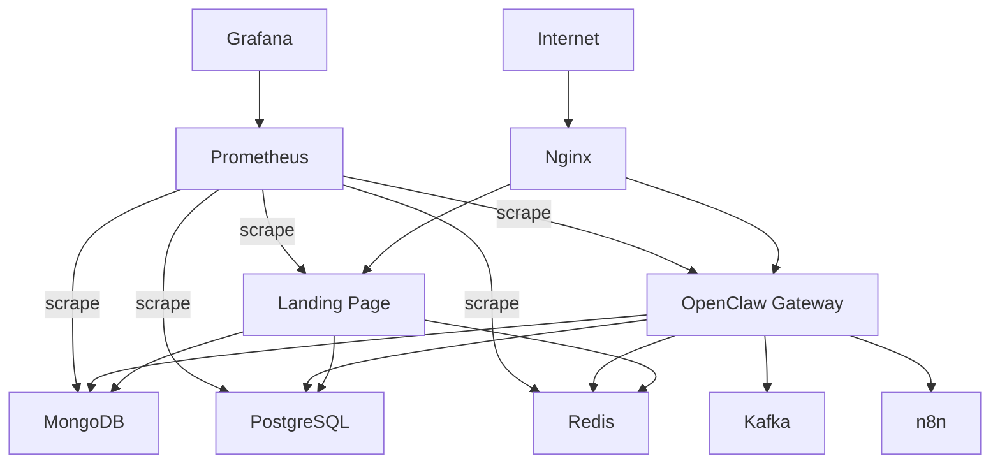

# OpenClaw DevOps Wiki

Welcome to the OpenClaw DevOps documentation wiki. This is your central hub for all documentation, guides, and references.

## 🚀 Quick Links

### Getting Started
- [[Quick Start Guide]]
- [[Installation]]
- [[Configuration]]
- [[First Deployment]]

### Core Documentation
- [[Architecture Overview]]
- [[Services Reference]]
- [[Environment Variables]]
- [[Docker Compose]]

### Deployment
- [[Local Development]]
- [[GCE Deployment]] → **New: [Complete GCE Guide](deployment/GCE-Deployment-Guide.md)**
- [[Production Checklist]]
- [[CI/CD Pipeline]]

### Services
- [[Nginx Configuration]]
- [[Landing Page]]
- [[OpenClaw Gateway]]
- [[MongoDB Setup]]
- [[PostgreSQL Setup]]
- [[Redis Configuration]]
- [[Kafka & Zookeeper]]
- [[n8n Workflows]]
- [[Monitoring Stack]]

### Operations
- [[Service Management]]
- [[Backup & Restore]]
- [[Monitoring & Alerts]]
- [[Log Management]]
- [[Security Best Practices]]

### Troubleshooting
- [[Common Issues]]
- [[Port Conflicts]]
- [[Database Connection Issues]]
- [[Container Problems]]
- [[Network Debugging]]

## 📊 Stack Overview



## 🗂️ Documentation Structure

### `/setup`
Initial setup and installation guides
- [[Installation|setup/Installation]]
- [[Configuration|setup/Configuration]]
- [[First Deployment|setup/First-Deployment]]

### `/services`
Individual service documentation
- [[All Services|services/Index]]
- Database services
- Messaging services
- Monitoring services

### `/deployment`
Deployment procedures
- [[Local|deployment/Local]]
- [[GCE|deployment/GCE]]
- [[Production|deployment/Production]]

### `/troubleshooting`
Problem solving guides
- [[Common Issues|troubleshooting/Common-Issues]]
- [[FAQ|troubleshooting/FAQ]]

### `/guides`
How-to guides and tutorials
- [[Database Backup|guides/Database-Backup]]
- [[SSL Setup|guides/SSL-Setup]]
- [[Monitoring Setup|guides/Monitoring-Setup]]

## 🔧 Quick Commands

### Start Services
```bash
# Basic stack
./start-all.sh

# Full stack
./scripts/start-full-stack.sh

# Only databases
./scripts/start-databases.sh

# Only monitoring
./scripts/start-monitoring.sh
```

### Management
```bash
# View logs
docker-compose -f docker-compose.full.yml logs -f

# Restart service
docker-compose -f docker-compose.full.yml restart <service>

# Check status
docker-compose -f docker-compose.full.yml ps
```

### GCE Deployment
```bash
cd deployments/gce
./deploy.sh
./scripts/status.sh
```

## 📚 External Resources

- [Docker Documentation](https://docs.docker.com/)
- [Nginx Documentation](https://nginx.org/en/docs/)
- [MongoDB Documentation](https://docs.mongodb.com/)
- [PostgreSQL Documentation](https://www.postgresql.org/docs/)
- [Redis Documentation](https://redis.io/documentation)
- [Kafka Documentation](https://kafka.apache.org/documentation/)
- [n8n Documentation](https://docs.n8n.io/)
- [Prometheus Documentation](https://prometheus.io/docs/)
- [Grafana Documentation](https://grafana.com/docs/)

## 🏷️ Tags

#wiki #documentation #openclaw #docker #devops #gce #monitoring

---

*Last Updated: 2026-02-08*
*Maintained by: OpenClaw Team*
*Latest: GCE deployment completed - All services running on bmt-staging-research*
