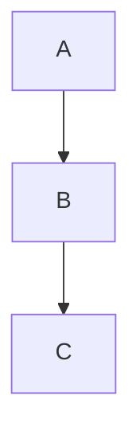

# OpenClaw DevOps Wiki

This wiki contains comprehensive documentation for the OpenClaw DevOps project in Obsidian-compatible markdown format.

## 📖 Using This Wiki

### With Obsidian

1. **Open in Obsidian:**
   - Open Obsidian
   - Click "Open folder as vault"
   - Select `/Users/lps/server/wiki`

2. **Navigation:**
   - Start at [[Home]]
   - Click wikilinks to navigate: `[[Page Name]]`
   - Use search: `Cmd/Ctrl + O`
   - Browse tags: Click any `#tag`

3. **Features:**
   - Graph view: See page connections
   - Backlinks: See what links to current page
   - Tag pane: Browse by category
   - Search: Full-text search across all pages

### Without Obsidian

All files are standard markdown and can be viewed in:
- Any text editor
- GitHub/GitLab (with limited features)
- Markdown viewers
- VS Code with markdown extension

## 📁 Structure

```
wiki/
├── Home.md                      # Start here!
├── Architecture-Overview.md
├── Quick-Start-Guide.md
│
├── setup/                       # Setup & Installation
│   └── Quick-Start-Guide.md
│
├── services/                    # Service Documentation
│   └── Index.md
│
├── deployment/                  # Deployment Guides
│   └── GCE.md
│
├── troubleshooting/            # Problem Solving
│   └── (to be populated)
│
└── guides/                     # How-to Guides
    └── (to be populated)
```

## 🔗 Key Pages

- **[[Home]]** - Wiki home page
- **[[Quick Start Guide]]** - Get started quickly
- **[[Architecture Overview]]** - System design
- **[[Services Reference|services/Index]]** - All services
- **[[GCE Deployment|deployment/GCE]]** - Deploy to GCE

## 🏷️ Tags

Browse documentation by tags:

- `#setup` - Setup and installation
- `#services` - Service documentation
- `#deployment` - Deployment guides
- `#troubleshooting` - Problem solving
- `#architecture` - System design
- `#guide` - How-to guides

## ✍️ Contributing

### Adding New Pages

1. Create markdown file in appropriate folder
2. Add YAML frontmatter:
```yaml
---
title: Page Title
tags: [tag1, tag2]
created: YYYY-MM-DD
related: [[Related Page 1]], [[Related Page 2]]
---
```

3. Add content using markdown
4. Link from relevant pages using `[[Page Name]]`
5. Update [[Home]] if it's a major page

### Markdown Features

**Wikilinks:**
```markdown
[[Page Name]]                    # Link to page
[[Page Name|Display Text]]       # Link with custom text
[[folder/Page]]                  # Link to page in folder
```

**Tags:**
```markdown
#tag                             # Single tag
#nested/tag                      # Nested tag
```

**Callouts:**
```markdown
> [!info]
> Information callout

> [!warning]
> Warning callout

> [!tip]
> Tip callout
```

**Code Blocks:**
````markdown
```bash
# Bash commands
./script.sh
```
````

**Diagrams:**
````markdown

````

### Style Guide

- Use sentence case for titles
- Add frontmatter to all pages
- Link to related pages
- Use appropriate tags
- Include code examples
- Add diagrams where helpful

## 🔧 Obsidian Plugins (Optional)

Recommended plugins:
- **Dataview** - Query and list pages
- **Kanban** - Task boards
- **Calendar** - Date-based navigation
- **Excalidraw** - Diagrams
- **Git** - Version control

## 📊 Statistics

Current pages:
- 5 main documentation pages
- Multiple reference sections
- Comprehensive architecture docs
- Deployment guides

## 🔄 Updates

Last updated: 2026-02-07

Keep documentation updated when:
- Adding new services
- Changing architecture
- Updating deployment procedures
- Discovering solutions to problems

## 📚 Related Documentation

Outside wiki:
- `/Users/lps/server/README.md` - Project overview
- `/Users/lps/server/CLAUDE.md` - Claude Code guide
- `/Users/lps/server/DEPLOYMENT.md` - Deployment details
- `/Users/lps/server/SERVICES.md` - Service reference

---

**Start Here:** [[Home]]

#readme #meta #wiki
