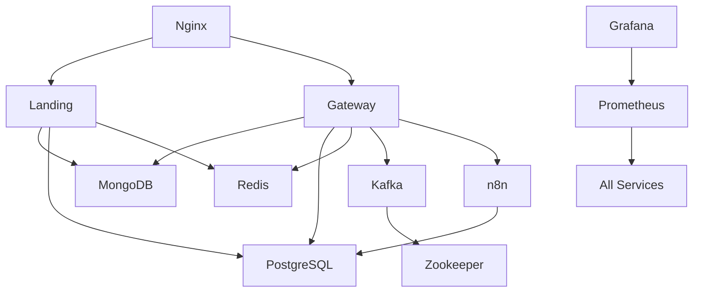

# Services Reference

Complete reference for all services in the OpenClaw DevOps stack.

## 🌐 Core Services

### [[Nginx Configuration|Nginx]]
**Port:** 80, 443
**Purpose:** Reverse proxy and load balancer
**Config:** `nginx/nginx.conf`, `nginx/conf.d/*.conf`

**Key Features:**
- SSL termination
- Rate limiting
- Request routing
- Static caching
- Health checks

[[Nginx Configuration|Learn more →]]

### [[Landing Page]]
**Port:** 3000
**Framework:** Next.js 16
**Config:** `apps/landing/next.config.ts`

**Key Features:**
- Server-side rendering
- Standalone build
- API routes
- Optimized production build

[[Landing Page|Learn more →]]

### [[OpenClaw Gateway]]
**Port:** 18789
**Purpose:** AI Agent Gateway
**Config:** `deployments/*/config/openclaw-gateway.json`

**Key Features:**
- Agent management
- Telegram integration
- Workflow automation
- Token authentication

[[OpenClaw Gateway|Learn more →]]

## 🗄️ Database Services

### [[MongoDB Setup|MongoDB]]
**Port:** 27017
**Version:** 7
**Init:** `scripts/mongo-init.js`

**Collections:**
- users, sessions, workflows, events

**Features:**
- Document database
- Auto-indexing
- Authentication

[[MongoDB Setup|Learn more →]]

### [[PostgreSQL Setup|PostgreSQL]]
**Port:** 5432
**Version:** 16
**Init:** `scripts/postgres-init.sql`

**Databases:**
- openclaw, n8n

**Features:**
- ACID compliance
- Extensions (uuid, pg_trgm)
- JSON support

[[PostgreSQL Setup|Learn more →]]

### [[Redis Configuration|Redis]]
**Port:** 6379
**Version:** 7
**Type:** In-memory

**Use Cases:**
- Caching
- Sessions
- Pub/sub

**Features:**
- 256MB limit
- LRU eviction
- RDB persistence

[[Redis Configuration|Learn more →]]

## 📨 Messaging Services

### [[Kafka & Zookeeper|Kafka]]
**Port:** 9092
**Version:** Confluent 7.5
**Coordination:** Zookeeper (2181)

**Features:**
- Event streaming
- Topic-based
- High throughput

[[Kafka & Zookeeper|Learn more →]]

### [[n8n Workflows|n8n]]
**Port:** 5678
**Version:** Latest
**Database:** PostgreSQL

**Features:**
- Workflow automation
- 200+ integrations
- Webhook support
- Visual designer

[[n8n Workflows|Learn more →]]

## 📊 Monitoring Services

### [[Prometheus]]
**Port:** 9090
**Config:** `monitoring/prometheus/prometheus.yml`

**Features:**
- Metrics collection
- 30-day retention
- Alert rules
- PromQL

[[Prometheus|Learn more →]]

### [[Grafana]]
**Port:** 3001
**Config:** `monitoring/grafana/provisioning/`

**Features:**
- Dashboards
- Alerts
- User management
- Plugins

[[Grafana|Learn more →]]

### [[Exporters]]
**Ports:** Various

**Available Exporters:**
- Node Exporter (9100) - System metrics
- cAdvisor (8080) - Container metrics
- Redis Exporter (9121)
- Postgres Exporter (9187)
- MongoDB Exporter (9216)

[[Exporters|Learn more →]]

## 🔧 Service Management

### Starting Services

```bash
# All services
./scripts/start-full-stack.sh

# Specific services
docker-compose -f docker-compose.full.yml up -d mongodb postgres redis

# Only monitoring
./scripts/start-monitoring.sh
```

### Stopping Services

```bash
# All services
docker-compose -f docker-compose.full.yml down

# Specific service
docker-compose -f docker-compose.full.yml stop gateway
```

### Restarting Services

```bash
# All services
docker-compose -f docker-compose.full.yml restart

# Specific service
docker-compose -f docker-compose.full.yml restart mongodb
```

### Viewing Logs

```bash
# All services
docker-compose -f docker-compose.full.yml logs -f

# Specific service
docker-compose -f docker-compose.full.yml logs -f landing

# Last 100 lines
docker-compose -f docker-compose.full.yml logs --tail=100 gateway
```

## 📋 Service Dependencies



## 🔗 Quick Links

### Configuration Files
- [[Environment Variables]]
- [[Docker Compose]]
- [[Nginx Configuration]]

### Operations
- [[Service Management]]
- [[Backup & Restore]]
- [[Log Management]]

### Troubleshooting
- [[Common Issues]]
- [[Database Connection Issues]]
- [[Container Problems]]

## 📊 Service Status

Check service status:
```bash
# Container status
docker-compose -f docker-compose.full.yml ps

# Health checks
curl http://localhost/health        # Nginx
curl http://localhost:3000          # Landing
curl http://localhost:18789/health  # Gateway
curl http://localhost:9090/-/healthy # Prometheus
curl http://localhost:3001/api/health # Grafana
```

## 🏷️ Service Tags

Browse by category:
- #core-services
- #database-services
- #messaging-services
- #monitoring-services

---

**See Also:** [[Architecture Overview]], [[Docker Compose]], [[Service Management]]

#services #reference #index
